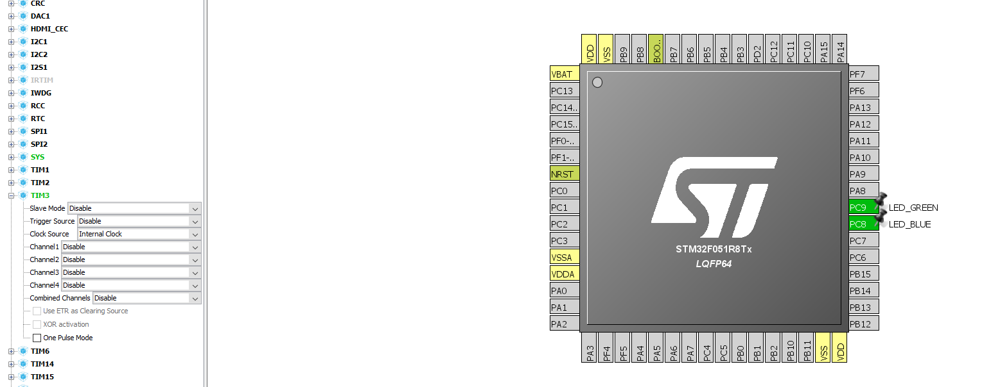

## STM32 HAL NON-BLOCKING blinky ##

This project is safe to use for blinking since it doesn't block code execution anywhere.
It uses TIM3 to count to 500ms and toggle both LEDS.

Learning objectives:
- TIM3
- Interrupts

STM32F051C8 LQFP64 processor on the STM32F0Discovery board was used for developing.

Project configuration:

